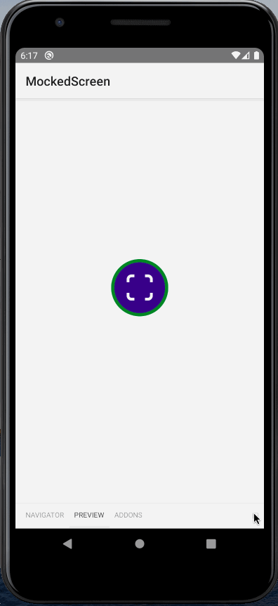
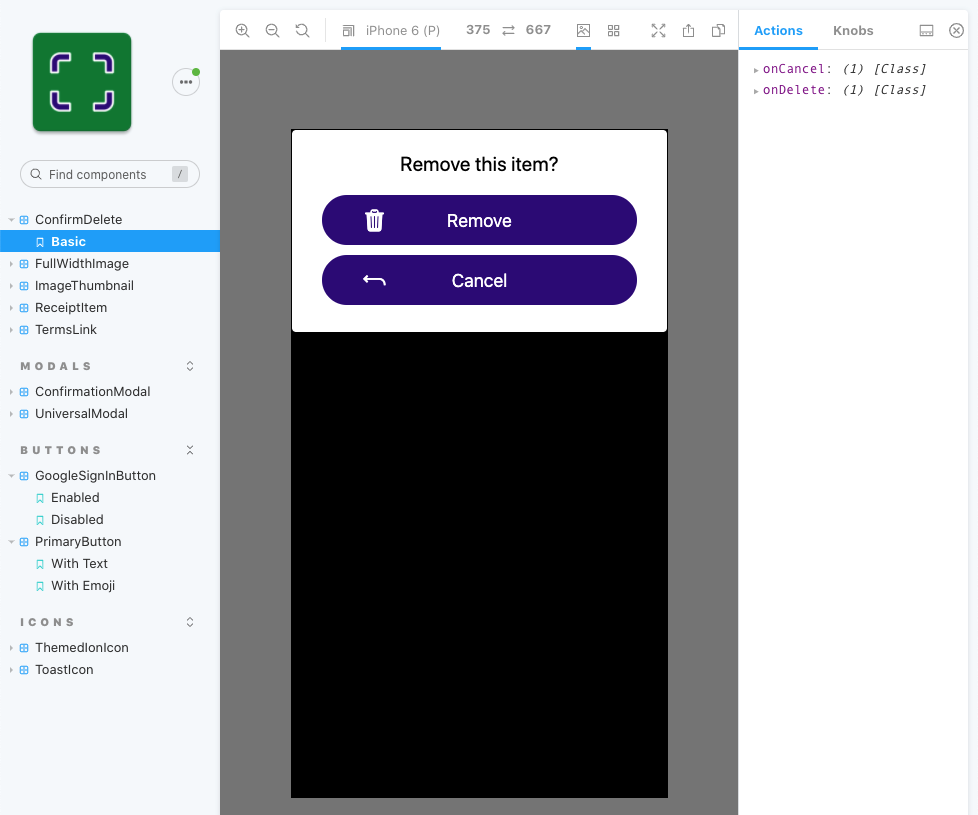
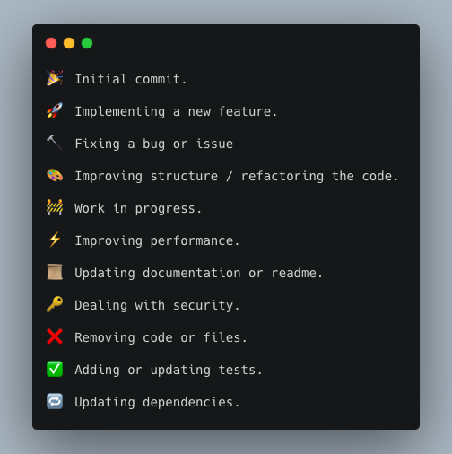

[](https://github.com/petr7555/bachelors_thesis_accounting_ocr/actions/workflows/CI.yml)
[](https://github.com/petr7555/bachelors_thesis_accounting_ocr/actions/workflows/e2e-android.yml)
[](https://github.com/petr7555/bachelors_thesis_accounting_ocr/actions/workflows/python-api.yml)

# Receipts Scanner

This application was created as my bachelor's thesis.

It serves as a digital database of receipts. The receipts are captured using a phone camera. An OCR service extracts the
receipt information and pre-fills the form. The form can then be further edited. The receipts can be searched by the
merchant name, merchant address and item names of the receipt. It is written in React Native. It
uses [Microsoft Form Recognizer](https://docs.microsoft.com/cs-cz/azure/cognitive-services/form-recognizer/overview) for
information extraction from the image,
[Magnitude](https://github.com/plasticityai/magnitude) to categorize receipt items and [OpenCV](https://opencv.org/) for
image processing. It is available on Android and Windows. However, it is not in the stores yet.

## Demo

<p>
  
  &nbsp; &nbsp; &nbsp; &nbsp;
  
</p>

## Local development

> Not all functionality (e.g. running unit tests) is described in this README.
> See `package.json` for all available npm scripts.

### Android

If you want to try the application:

1. go to [GitHub CI action](https://github.com/petr7555/bachelors_thesis_accounting_ocr/actions/workflows/CI.yml)
2. click on the latest run that passed
3. scroll to the end of the page and download the `app-release.apk` artifact
4. unzip it and move the `app-release.apk` file to your phone and install it
5. now run the newly installed Receipts Scanner

If you want to run the application on the emulator or develop the application, follow
the [environment setup](https://reactnative.dev/docs/environment-setup). (Choose **React Native CLI Quickstart**,
your **Development OS** and **Android** as the **Target OS**.)

Then:

```bash
# clone the repository
git clone https://github.com/petr7555/bachelors_thesis_accounting_ocr
cd bachelors_thesis_accounting_ocr
# install dependencies
npm ci
# run the application on an emulator or connected device (this command starts Metro bundler (and emulator) automatically)
npm run android
```

### Windows

There is currently no executable you could install to run the application. You need
to [setup the environment](https://microsoft.github.io/react-native-windows/docs/rnw-dependencies). If you do not have
Windows PC, you can [use virtual machine](https://microsoft.github.io/react-native-windows/docs/win10-vm).

Then:

```bash
# clone the repository
git clone https://github.com/petr7555/bachelors_thesis_accounting_ocr
cd bachelors_thesis_accounting_ocr
# install dependencies
npm ci
# run the application on PC (this command starts Metro bundler automatically)
npm run windows
```

## Storybook

[Storybook](https://storybook.js.org/) has been used as a component library. It can be run on the emulator/device,
optionally with a browser tab open to switch the stories. Thanks
to [React Native for Web](https://github.com/necolas/react-native-web), also regular Storybook for Web can be used.

### Storybook for React Native

#### Run Storybook for React Native

- `npm run android`
- `npm run storybook:rn`
- Refresh the application in the metro bundler. The components should now be visible in the browser in the sidebar.
- The Storybook running in the browser is used to *navigate* between components. The components themselves are shown on
  a mobile device/emulator.
- When adding a new story, you must import it in `~/storybook-rn/storybook-registry.ts`.
- This video shows how Storybook running on an emulator looks:

  

### Storybook for Web

- Web version of Storybook is deployed to https://bachelors-thesis-accounting-ocr.vercel.app/ with each push to GitHub.
  This is not part of GitHub Actions but [Vercel's](https://vercel.com/petr7555/bachelors-thesis-accounting-ocr) own
  repository hook. This deployment is partially redundant because Storybook is also deployed
  during [Chromatic build](#chromatic).
- A directory `.vercel` containing a `project.json` with *orgId* and *projectId* needs to be present in the root of the
  repository to deploy the Storybook to Vercel locally, which is done by running `npm run deploy-vercel`
  (currently does not work because the file number limit is reached). This directory is ignored in version control as it
  contains sensitive information.
- Keep in mind, that in Storybook for Web `Platform.OS === 'web'`, so both `isAndroid` and `isWindows` are `false`.
- Storybook for Web finds all stories that match this pattern `../src/**/*.stories.tsx`.
- This image shows how Storybook running on the web looks:

  

### Syntax

Because [Storybook for Web](https://storybook.js.org/docs/react/get-started/introduction) is in version 6, it can use
the modern Storybook syntax. However, the
latest [Storybook for React Native](https://storybook.js.org/tutorials/intro-to-storybook/react-native/en/get-started/)
is only in version 5 and requires the old syntax.

- `storiesOf` creates the story for React Native
- `export const WithEmoji` together with

```tsx
export default {
    title: 'Buttons/PrimaryButton',
};
```

creates the story for Web. We can reuse some code by writing the story the following way:

```tsx
export const WithEmoji = () => (
    <PrimaryButton onPress={action('clicked-emoji')} title="😀 😎 👍 💯 🚀"/>
);

storiesOf('PrimaryButton', module).add('With emoji', WithEmoji);

export default {
    title: 'Buttons/PrimaryButton',
};
```

## Testing

### Run E2E tests locally

- `npm run start` to start the Metro bundler. We need it because debug version of the app is run.
- `npm run e2e:build`
- `npm run e2e:test`
- troubleshooting:
    - `npm run start --reset-cache`
    - make sure the **App** is visible and not the Storybook

### E2E tests in CI pipeline

- Release version of the app is built, therefore the Metro bundler is not needed.
- Artifacts from the tests (both passing and failing) are saved. These contain:
    - logs
    - screenshots
    - videos
    - timeline
- [Configuration of artifacts](https://github.com/wix/Detox/blob/master/docs/APIRef.Artifacts.md)

### Visual regression testing

#### Run visual regression Loki tests for React Native:

> ⚠️ At the current stage, the visual regression Loki tests for React Native are unreliable and should not be used.

- `npm run android`
- `npm run storybook:rn`
- Refresh the application in the metro bundler. The components should now be visible in the browser in the sidebar.
- `npm run loki:update:rn` to create reference images
- `npm run loki:test:rn` to create new images and compare them with the reference images
- ⚠️ set `const VISUAL_TESTS = true;` in `index.js`, this reduces flakiness
- ⚠️ there is still a lot of flakiness, many elements interfere with the snapshots

#### Run visual regression Loki tests for Web:

- `npm run storybook:web`
- `npm run loki:update:web` to create reference images
- `npm run loki:test:web` to create new images and compare them with the reference images

#### Run visual regression [Storycap](https://github.com/reg-viz/storycap) / [Reg Suit](https://github.com/reg-viz/reg-suit) tests for React Native Web:

> ⚠️ Storycap / Reg Suit tests do not work correctly
> (Reg Suit does not recognize properly the id of the previous snapshots and reports all stories as new),
> therefore Chromatic should be used instead.

- `npm run storycap:web` takes the screenshots and saves them to `__screenshots__`
- `npm run reg-suit:web:dev` **dev**, as opposed to **ci**, exports path to Google Application Credentials file. A
  file `g_app_cred.json` containing the credentials needs to be present in the root of the repository. These credentials
  are used to connect to Google's bucket, where snapshot images are stored. This file is ignored in version control as
  it contains sensitive information. In the CI pipeline, repository secrets stored on GitHub are used instead.
- `visual-test:web:dev` is a shortcut for the two commands above

  ##### How Storycap / Reg Suit works:

    - First, note that doing this makes sense when there are no uncommitted changes.
    - Reg-suit expects that this is run after you have committed all changes.
    - You take screenshots of the current state of the app by running `npm run storycap:web`. They are saved
      into `__screenshots__`.
    - `reg-suit sync-expected` uses
      the [keygen plugin](https://github.com/reg-viz/reg-suit/blob/master/packages/reg-keygen-git-hash-plugin/README.md)
      to detect the previous commit when snapshots have been published. It downloads screenshots from Google Cloud for
      this commit. The screenshots are stored in Google Cloud Storage inside `reg-publish-bucket-...` in a folder whose
      name is the detected commit. From there, they are downloaded and stored inside `.reg/expected` locally.
    - `reg-suit compare` copies new images from `__screenshots__` to `.reg/actual`, compares them with the images
      in `.reg/expected` and stores the difference in `.reg/diff`.
    - `reg-suit publish` uses the last commit hash to create a new folder in Google Cloud and upload new images there.
    - in CI, `reg-suit publish -n` is run with the `-n` parameter to create a PR comment on GitHub.

## Chromatic

- Chromatic is used for visual testing and Storybook deployment.
- During each push, the stories are compared for visual changes, and the Storybook is deployed.
- Apart from the ordinal Storybook UI, Chromatic also creates its own component library.
- The visual changes can be reviewed and, if they are desired, they should be accepted in
  the [Chromatic UI](https://www.chromatic.com/builds?appId=60432db1354dbd00232dedc5).
- The link to the newest changes is provided in the build output.
- To run it locally, run `npm run chromatic`.

## Serve Storybook from static files

- build: `npm run build-storybook:web` (this command is also used by Chromatic to build the static version of Storybook)
- serve: `npm run serve-storybook:web`

## Linting and typechecking

- TSLint is deprecated in favour of ESLint with TypeScript plugins.
- ESLint performs automated scans for common syntax and style errors.
- Prettier scans files for style issues and automatically reformats code to ensure consistent rules are being followed
  for indentation, spacing, semicolons, single quotes vs double quotes, etc.
- ESLint and Prettier might clash. This solves `eslint-config-prettier` configuration, which turns off
  formatting-related rules that might conflict with Prettier.
- `eslint-plugin-prettier` is a plugin that integrates Prettier to ESLint, so that ESLint reports Prettier errors.
- ESLint can also catch type errors. However, using the TypeScript compiler itself is probably better - `tsc --noEmit`.

## Debugging

### In Webstorm:

- Run `RN Debug` configuration in debug mode.
- Press `⌘M` to toggle In-App Developer Menu. Click Debug (second option from the top).
- Reload the application (in the browser on `http://localhost:8081/debugger-ui/` or in the In-App Developer Menu (`⌘M`))
  .

### Further tips on debugging:

- https://reactnative.dev/docs/debugging

## Tools for easier development

- [Reactotron](https://github.com/infinitered/reactotron)
    - if the device is not connected, run `adb reverse tcp:9090 tcp:9090` and refresh (`r`) in the metro bundler. This
      applies both to an emulator and a real device.
- [patch-package](https://www.npmjs.com/package/patch-package) can be used to fix third-party dependencies
  in `node_modules`. `postinstall` script is run automatically both after `npm install` and `npm ci`.

## Theming

- Use constants in `~/src/global/styles/colors.ts` for colors that do not change based on light/dark mode.
- Use `useTheme` hook from `react-native-elements` to obtain a theme that changes according to whether a dark mode is
  enabled or not (for black and white colors).
- This `Component` will have a black color in light mode and white color in dark mode.

```tsx
import {useTheme} from 'react-native-elements';

const {theme} = useTheme();
return <Component color={theme.colors?.black}/>;
```

- Always use `Text` from `react-native-elements` to reflect the dark mode settings.
- Use `useTheme` hook from `@react-navigation/native` to obtain a theme that changes according to whether a dark mode is
  enabled or not for any colors. These colors have to be defined in `App.tsx` for `MyDefaultTheme` and `MyDarkTheme`.

```tsx
import {useTheme} from '@react-navigation/native';
import {MixedTheme} from '../../../App';

const {colors} = useTheme() as MixedTheme;
return <Component style={{color: colors.secondary}}/>;
```

## Logging

- Do not use `console.log()` etc.
- Use `LOG.info()` etc. from `~/src/services/Logger/logger.ts` instead.
  See [react-native-logs](https://www.npmjs.com/package/react-native-logs) for usage instructions.
- In development mode, all logs will appear in the console. WARN and higher will be sent to
  the [Sentry](https://sentry.io/organizations/petr-janik/projects/bachelors-thesis-accounting-ocr/) too (both in
  development and release).

## Clean emulator data

- `emulator -list-avds`
- the emulator to be cleaned must not be running
- `emulator -avd Pixel_3a_API_29 -wipe-data`

## Build signed release AAB package

Follow https://reactnative.dev/docs/signed-apk-android or run:

```bash
cd android
./gradlew bundleRelease
```

The build uses a password stored in a Keychain, as described
in [this](https://pilloxa.gitlab.io/posts/safer-passwords-in-gradle/) tutorial. It also
requires `my-upload-key.keystore` file that should be in `~/android/app/` folder. This file is ignored in version
control as it contains sensitive information. If the file is not present (e.g. in a CI pipeline), the debug
signingConfig will be used, and a warning will be shown in the console.

Upload the generated `~/android/app/build/outputs/bundle/release/app-release.aab`
to [Google Play Console](https://play.google.com/console/).

This project
uses [Google Cloud Platform](https://console.cloud.google.com/home/dashboard?folder=&organizationId=&project=bachelorsthesisaccountingocr)
and [Google Firebase](https://console.firebase.google.com/u/0/project/bachelorsthesisaccountingocr/overview) for:

- Authentication
- Firestore
- Storage
- Google Cloud Build, Google Container Registry and Google Cloud Run for the deployment of Python API container

[Microsoft Azure's](https://portal.azure.com/#home) services are used for:

- OCR - Form Recognizer from Cognitive Services

This application uses its own Python API for image processing and item categorization. See
the [python-api/README.md](https://github.com/petr7555/bachelors_thesis_accounting_ocr/blob/master/python-api/README.md)
.

## Auto-linking

Auto-linking happens automatically at the start of `npm run android`/`npm run windows` command. It can be triggered
manually by running `npx react-native link`.

## Commit messages format



## Troubleshooting

1. Invariant Violation: Module AppRegistry is not a registered callable module (calling runApplication)
    - solution: `npm start -- --reset-cache`
    - Check if there are other errors above,
      e.g. `TypeError: Cannot read property '<some property of native module>' of undefined`. This happens on Windows.
      It means that the native module has not been linked
      automatically. [Try linking it manually.](https://microsoft.github.io/react-native-windows/docs/native-modules-using)
      However, most likely, the Windows support is old, vnext support is needed. Mock the library and wait for the vnext
      support to be implemented.
2. If you have multiple connections in Reactotron, switch to the correct one to be able to control Storybook.
3. DO NOT DELETE `package-lock.json`! Dependencies will resolve badly, and something like this will show up:
    ```
    error: Error: Unable to resolve module ./prebuilt.rn-99b47b70.js from /Users/petr.janik/Documents/Projects/bachelors_thesis_accounting_ocr/node_modules/@firebase/firestore/dist/rn/index.js: ./prebuilt.rn-99b47b70.js could not be found within the project.
    ```
4. `new Date()` behaves differently in RN and in the browser. The browser implementation is used when Debug is enabled.
   Whereas `new Date("2007/13:29:17")` fails without the debug mode, with debug mode and in the browser console, it
   returns the correct date.
5.

 ```
 Failed to restore the NuGet packages: Error: Errors in packages.config projects
 The process cannot access the file 'C:\Users\User\Desktop\bachelors_thesis_accounting_ocr\windows\packages\Microsoft.SourceLink.GitHub.1.0.0\tools\net461\Microsoft.SourceLink.GitHub.dll' because it is being used by another process.
 ```

Solution: Kill `MSBuild.exe` in Task Manager.

6.

 ```
 Invariant Violation: Module AppRegistry is not a registered callable module (calling runApplication)
 ```

Solution: Kill `Node.js` in Task Manager.

7. When adding GitHub branch as a dependency, add it as `"dependency-name": "user/repository#branch"`
   into `package.json` and make sure that `package-lock.json` contains `"resolved": "git+https://git@github.com/...`,
   not `"resolved": "git+ssh://git@github.com/...`.

8. `INSTALL_FAILED_INSUFFICIENT_STORAGE`

Uninstall previously installed app.

9. Error: Unable to resolve module ./debugger-ui/debuggerWorker.aca173c4 from .../bachelors_thesis_accounting_ocr/.:
   ./debugger-ui/debuggerWorker.aca173c4 could not be found within the project.

This is not a problem, ignore it.

## Privacy Policy, Terms & Conditions

Privacy Policy and Terms & Conditions have been generated using https://app-privacy-policy-generator.firebaseapp.com/
and slightly modified in the paragraph *Privacy Policy -> Information Collection and Use*.

They are available at [Privacy Policy](https://receipts-scanner.flycricket.io/privacy.html) and
[Terms & Conditions](https://receipts-scanner.flycricket.io/terms.html).

They can be edited at https://app.flycricket.com/.

## Text of thesis

The source for the thesis text is available in
a [separate repository](https://github.com/petr7555/Receipt-database-with-OCR-scan-thesis-text). It describes the
application architecture and functionality.
